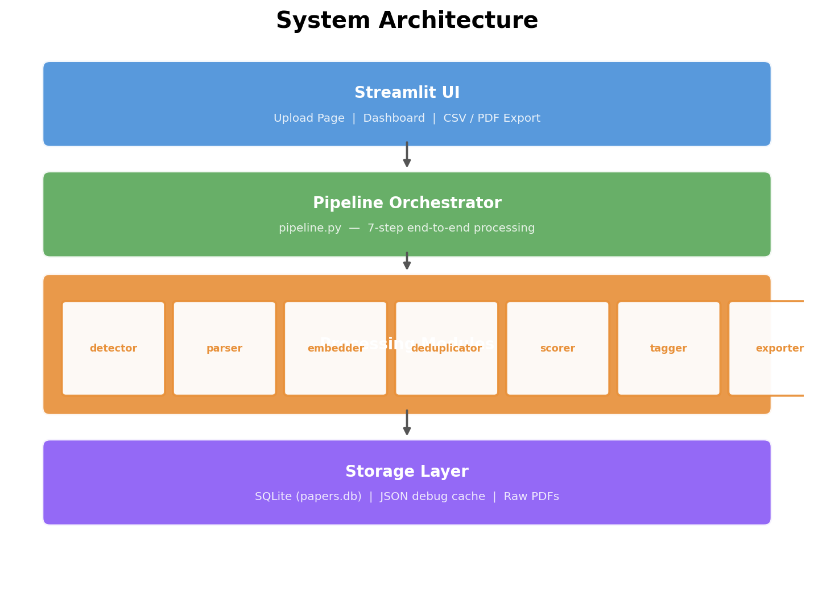
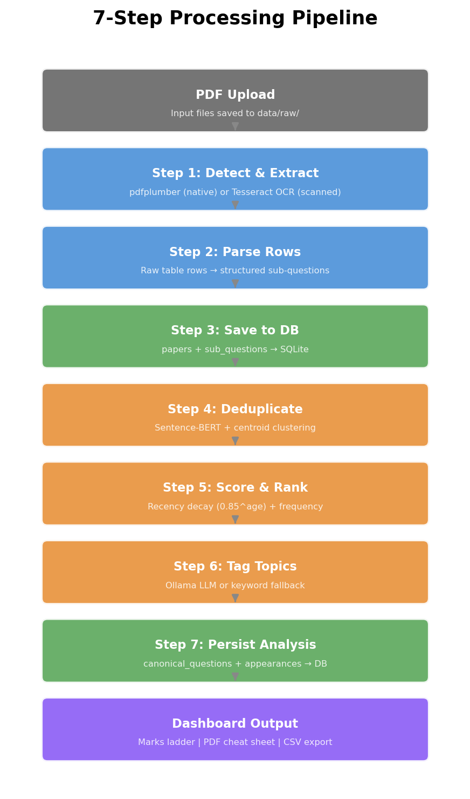
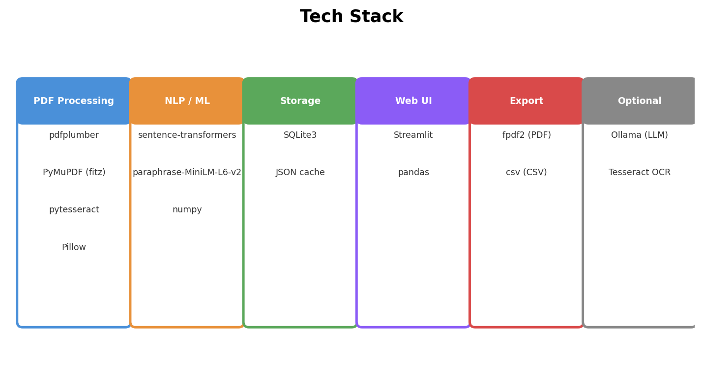
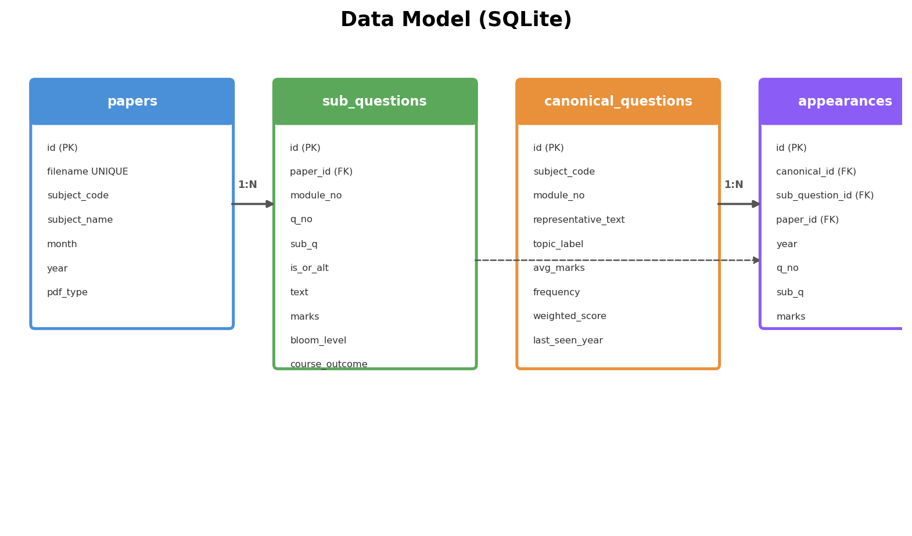

# Papers Please

**An AI-powered exam question analyser for VTU students and faculty.**

Built by **Nirbhik Chaki** and **Prabhat Anil Bajpai** at **CMR Institute of Technology, Bengaluru**.

Upload past VTU question papers. Get a ranked, module-wise breakdown of what to study first — backed by semantic NLP, not guesswork.



---

## Table of Contents

- [The Problem](#the-problem)
- [Our Solution](#our-solution)
- [How It Works](#how-it-works)
- [The 7-Step Pipeline](#the-7-step-pipeline)
- [Algorithms and Research](#algorithms-and-research)
- [Tech Stack](#tech-stack)
- [Key Imports That Power It](#key-imports-that-power-it)
- [CSV Export for Teachers](#csv-export-for-teachers)
- [Data Model](#data-model)
- [Problems We Faced and How We Solved Them](#problems-we-faced-and-how-we-solved-them)
- [What We Learned](#what-we-learned)
- [Setup and Usage](#setup-and-usage)
- [Limitations and Future Work](#limitations-and-future-work)

---

## The Problem

VTU (Visvesvaraya Technological University) exams follow the CBCS pattern: 5 modules per subject, each worth 20 marks, 10 questions total with OR choices. Across exam sessions — January, June, December — **questions repeat**. Sometimes word-for-word. Sometimes rephrased: "Explain CRC" becomes "Describe CRC encoder operation with a neat diagram."

### The student's pain

- You have 4-5 past papers. Each has 30+ sub-questions. Across 5 papers, that is 150+ questions — but maybe only 40-50 are truly unique.
- There is **no systematic way** to know which questions repeat, which are one-offs, and which topics are gaining momentum in recent years.
- Students either study everything (burnout) or rely on word-of-mouth ("Module 3 is important this time") which is unreliable.
- The real cost: **wasted study hours on topics that have never been asked and probably won't be**.

### The teacher's pain

- Faculty setting internal assessment papers manually go through stacks of old papers to pick "good" questions.
- There is no structured, searchable question bank — just PDFs.
- Building a balanced internal paper (covering modules, bloom levels, marks distribution) is tedious manual work.

---

## Our Solution

Papers Please takes those same PDFs and turns them into actionable intelligence:

1. **Upload** any number of VTU past papers (scanned or digital — both work).
2. The system **extracts every sub-question** with its marks, Bloom's taxonomy level, and course outcome.
3. An NLP model **detects when the same question appears across papers** — even when worded differently.
4. Each topic gets a **priority score** based on how often it repeats and how recently.
5. A **"Marks You Lock In" ladder** tells you: "Study these 3 topics and you statistically cover this module."
6. Export a **PDF cheat sheet** for quick revision or a **CSV question bank** that teachers can use to build internal assessments.

The key insight: **exam preparation is an optimisation problem**. Given limited study time, which topics maximise your expected marks? This tool answers that with data.

---

## How It Works

The system has a clean layered architecture:


- **Streamlit UI** — Upload papers, view analysis, download exports
- **Pipeline Orchestrator** (`pipeline.py`) — Coordinates 7 processing steps
- **Processing Modules** — Each handles one concern: extraction, parsing, embedding, clustering, scoring, labelling, exporting
- **Storage Layer** — SQLite database for persistence, JSON cache for debugging

---

## The 7-Step Pipeline

Every PDF goes through this pipeline from upload to dashboard:



### Step 1: Detect and Extract

The first challenge is reading the paper. VTU papers come in two forms:

| Type | What it is | Tool used |
|------|-----------|-----------|
| **Native** | Digitally created PDF with embedded text | `pdfplumber` |
| **Scanned** | Photo/scan with no text layer | `PyMuPDF` + `Tesseract OCR` |

Detection logic: if total extracted text < 100 characters or no tables found, treat as scanned.

For scanned PDFs, pages are rendered at **300 DPI** as grayscale arrays, then Tesseract runs in PSM 6 mode (uniform text block) to get word-level bounding boxes. Words are grouped into rows by vertical proximity and assigned to columns using **fixed proportional splits** calibrated from real VTU papers:

| Column | Page width range |
|--------|-----------------|
| Q.No | 0% – 13% |
| Sub | 13% – 17% |
| Question text | 17% – 74% |
| Marks | 74% – 83% |
| Bloom level | 83% – 89% |
| Course outcome | 89% – 98% |

### Step 2: Parse Rows

Raw table rows become structured sub-question records. The parser handles:
- **Garbled OCR** — "O22" means Q.2 (doubled digit), "0.7" means Q.7
- **Module headers** — "Module – 3" or garbled variants like "Mfodwle =P 1"
- **OR rows** — Skipped (these separate primary and alternate questions)
- **Continuation lines** — Multi-row question text is joined
- **Metadata extraction** — Marks, Bloom level (L1-L6), Course Outcome (CO1-CO5)

### Step 3: Save to DB

Paper metadata + all sub-questions are inserted into SQLite. Duplicate filenames are detected and skipped (or cleaned and re-inserted when force mode is enabled).

### Step 4: Deduplicate

This is the core algorithm. For each module of each subject, all sub-questions across all papers are encoded with **Sentence-BERT** and clustered using **centroid-based greedy clustering**. Questions like "Explain CRC" and "Describe CRC encoder operation with a diagram" land in the same cluster.

### Step 5: Score and Rank

Each canonical question gets a weighted score:
```
weighted_score = sum of 0.85^(current_year - paper_year) for each paper it appeared in
```
Recent appearances count more. A question in 4 out of 5 papers (80% frequency) with recent appearances scores higher than one in 2 out of 5 from 3 years ago.

### Step 6: Tag Topics

Each question cluster gets a short human-readable label. If Ollama (local LLM) is available, it generates labels like "CRC Encoder and Decoder". Otherwise, a keyword-frequency fallback extracts the top content words.

### Step 7: Persist Analysis

Canonical questions and their appearance records are written to the database for the dashboard and exports.

---

## Algorithms and Research

### Sentence-BERT Semantic Embeddings

**Model:** `paraphrase-MiniLM-L6-v2` from the `sentence-transformers` library.

- **Size:** ~90 MB, runs on CPU (no GPU required)
- **Output:** 384-dimensional dense vector per question
- **Why this model:** It is trained specifically on **paraphrase pairs** — meaning "Explain X" and "Describe the working of X with a diagram" map to nearby points in 384-D space

Why not `all-MiniLM-L6-v2` (the common default)? That model is trained on diverse web data for general similarity. Our problem is specifically about detecting **academic paraphrases** — same concept, different wording. The paraphrase-tuned variant handles this pattern significantly better.

All embeddings are **L2-normalised**, so cosine similarity reduces to a dot product — making similarity computation very efficient.

### Centroid-Based Greedy Clustering (Deduplication)

This is the core algorithm. It groups semantically similar questions into "canonical" question clusters:

```
For each new question embedding:
    Compare against the centroid (mean) of every existing cluster
    If best similarity >= 0.70:
        Join that cluster, update its centroid incrementally
    Else:
        Start a new cluster with this question as seed
```

**Why centroid-based?** Two questions A and B might not be directly similar to each other, but both might cluster around a centroid C. Comparing against centroids catches these transitive similarities.

**Why not k-means or DBSCAN?**
- k-means requires knowing the number of clusters upfront — we don't
- DBSCAN requires density parameters that don't generalise across modules
- Greedy clustering is O(N * C) where C << N, single-pass, and needs no hyperparameter tuning beyond the threshold

**Threshold = 0.70** was tuned on real VTU papers:
- 0.80+ is too strict — misses clear paraphrases like "explain X" vs "describe X with diagram"
- 0.60- is too loose — merges different topics within the same module

The centroid is updated using **Welford's incremental mean algorithm**, then re-normalised to unit length.

### Recency-Decay Scoring

Each canonical question is scored by both frequency and recency:

```
weighted_score = sum of DECAY^(current_year - paper_year)
```

Where `DECAY = 0.85`, giving:

| Paper year | Weight (if current = 2026) |
|------------|--------------------------|
| 2026 | 1.00 |
| 2025 | 0.85 |
| 2024 | 0.72 |
| 2023 | 0.61 |
| 2022 | 0.52 |

This is the same **exponential decay** model used in recommendation systems, financial momentum indicators, and email inbox aging. A question asked 3 times recently matters more than one asked 3 times five years ago.

**Expected marks** is calculated as:
```
expected_marks = (frequency / total_papers) * average_marks_when_asked
```

This answers: "If I study this topic, how many marks can I statistically expect?"

### Marks Ladder Construction

Questions are sorted by weighted score. Expected marks are accumulated top-down. When the cumulative sum hits the module max (20 marks), `full_coverage = True` — studying just those top N topics statistically covers the entire module.

---

## Tech Stack



| Library | Purpose | Why we chose it |
|---------|---------|----------------|
| **pdfplumber** | Native PDF table extraction | Best Python library for extracting tables with ruling lines from digital PDFs |
| **PyMuPDF (fitz)** | PDF-to-image rendering | Fastest Python PDF renderer — 300 DPI grayscale in milliseconds |
| **pytesseract** | OCR wrapper | Industry-standard Tesseract OCR with Python bindings |
| **Pillow** | Image format bridge | Converts between NumPy arrays and PIL Images for Tesseract |
| **sentence-transformers** | Sentence-BERT embeddings | Pre-trained paraphrase models, one-line API, CPU-friendly |
| **numpy** | Matrix operations | Embedding arithmetic, dot products, centroid computation |
| **pandas** | Tabular display | Streamlit's `st.dataframe` needs pandas DataFrames |
| **fpdf2** | PDF generation | Lightweight PDF builder — no heavyweight dependencies like ReportLab |
| **Streamlit** | Web UI | Fastest way to build data apps in Python — zero frontend code needed |
| **ollama** | Optional LLM labelling | Local LLM inference for generating topic labels (graceful fallback if unavailable) |
| **SQLite** | Database | Zero-config, file-based, perfect for single-user local apps |

---

## Key Imports That Power It

These are the specific imports and API calls that make the core pipeline work:

**Rendering a scanned PDF page to a NumPy array at 300 DPI:**
```python
import fitz  # PyMuPDF
mat = fitz.Matrix(300/72, 300/72)    # scale factor for 300 DPI
pix = page.get_pixmap(matrix=mat, colorspace=fitz.csGRAY)
arr = np.frombuffer(pix.samples, dtype=np.uint8).reshape(pix.h, pix.w)
```

**Getting word-level bounding boxes from Tesseract (PSM 6 = uniform block):**
```python
import pytesseract
data = pytesseract.image_to_data(
    pil_image,
    output_type=pytesseract.Output.DICT,
    config="--psm 6",
)
# Returns dict with keys: text, left, top, width, height, conf
```

**Loading a paraphrase-tuned Sentence-BERT and encoding questions:**
```python
from sentence_transformers import SentenceTransformer
model = SentenceTransformer("paraphrase-MiniLM-L6-v2")
embeddings = model.encode(texts, normalize_embeddings=True)
# Now cosine_sim(a, b) == dot(a, b) since both are L2-normalised
```

**Incremental centroid update (Welford's algorithm) for online clustering:**
```python
n_members = len(cluster_members[best])
new_centroid = old_centroid + (new_vec - old_centroid) / n_members
new_centroid = new_centroid / np.linalg.norm(new_centroid)  # re-normalise
```

**SQLite with WAL mode and foreign keys for concurrent reads:**
```python
conn = sqlite3.connect(db_path)
conn.execute("PRAGMA journal_mode=WAL")
conn.execute("PRAGMA foreign_keys=ON")
```

---

## CSV Export for Teachers

The CSV question bank is designed for **dual use**:

### For teachers setting internal assessments
- Export the full question bank as a CSV, sorted by module and priority
- Filter by module, marks range, or Bloom level to build a balanced paper
- Every question has been verified to appear in real VTU papers — no guesswork about difficulty or scope
- The frequency data shows which questions are "standard" vs niche

### For students using teacher-provided internals
- If your teacher uses this tool to build internals, the questions come from the same pool this tool analyses
- Study the high-frequency questions from the CSV and you are statistically preparing for both internals and the final exam

### CSV columns
| Column | Description |
|--------|-------------|
| Module | Module number (1-5) |
| Priority Rank | Rank within the module by weighted score |
| Topic Label | Short 3-5 word topic name |
| Question Text | Full representative question text |
| Avg Marks | Average marks when this question is asked |
| Times Repeated | Number of papers this question appeared in |
| Total Papers | Total papers analysed for this subject |
| Frequency % | How often it appears (percentage) |
| Years Seen | Which exam sessions it appeared in |
| Expected Marks | Statistical expected marks if you study this topic |
| Full Coverage | YES if studying up to this rank covers the full module |

---

## Data Model

The application uses SQLite with 4 tables:



- **papers** — One row per uploaded PDF. Filename has a UNIQUE constraint.
- **sub_questions** — Every individual sub-question extracted from every paper. Linked to its source paper.
- **canonical_questions** — Deduplicated question groups. Contains the representative text, topic label, frequency, and weighted score.
- **appearances** — Join table linking each canonical question to every sub-question occurrence across papers. This is how we track "Q3a in Jan 2025 and Q4b in Dec 2024 are the same question."

Canonical questions and appearances are deleted and rebuilt from scratch whenever new papers are added for a subject, ensuring consistency.

---

## Problems We Faced and How We Solved Them

### 1. OCR produces garbage for question numbers

Tesseract regularly reads "Q.2" as "O22", "0.7", "Qa", or "oO6". We built **loose regex patterns** with multiple fallback strategies:
```
Q.No patterns:  Q.1, O.4, 0.7, oO6, O22 (doubled digit → Q.2)
```
The doubled-digit pattern (`O22` → 2) was discovered by examining real OCR output across dozens of papers.

### 2. Column detection kept failing on pages with headers

Our initial approach used gap-based auto-detection to find column boundaries. It worked on clean pages but broke whenever headers, footers, or page numbers appeared — their word positions skewed the gap analysis.

**Solution:** We measured actual VTU papers and hardcoded **proportional column splits** (percentage of page width). VTU CBCS papers have a remarkably consistent layout, so fixed splits work reliably. This was a deliberate tradeoff: we lost generality but gained robustness for the specific domain.

### 3. "Explain X" vs "Describe X with a diagram" — are they the same?

The default similarity models (`all-MiniLM-L6-v2`) gave these a similarity of ~0.72 — below the typical 0.80 threshold. But for exam prep, these are clearly the same topic.

**Solution:** Switched to `paraphrase-MiniLM-L6-v2` (trained on paraphrase pairs) and lowered the threshold to 0.70. The paraphrase model gives these ~0.82 similarity, and the lower threshold catches the remaining edge cases.

### 4. Ollama not always available

Not every machine has Ollama installed. The tagger could not crash the pipeline just because topic labelling fails.

**Solution:** Three-tier fallback:
1. Try Ollama with the preferred model (phi3:mini)
2. Try any available model
3. Fall back to keyword-frequency extraction — no LLM needed

### 5. OCR text noise before embedding

Tesseract output contains artifacts: "AExplain" (run-together prefix), leading pipes and underscores, embedded sub-question labels ("a. Define..."). These degrade embedding quality.

**Solution:** A dedicated `_clean_for_embed()` function strips OCR-specific noise patterns before the text hits the embedding model, keeping the academic content intact.

### 6. Module header detection with garbled OCR

"Module – 3" becomes "Mfodwle =P 3" or "M[v]d — 1" after OCR. A strict regex only catches clean text.

**Solution:** A fuzzy regex chain:
1. Strict: `module\s*[-–—=~]*\s*(\d)` — catches clean headers
2. Fuzzy: `Mod(?:u|v|ul|ule)?\w*\s*[-–—=~P]+\s*([1-5])` — catches garbled OCR
3. Heuristic: short row with standalone digit 1-5 and no question words

---

## What We Learned

### Document Analysis and Information Extraction
- Real-world PDFs are messy — the gap between "works on clean examples" and "handles actual scanned papers" is enormous
- Domain-specific heuristics (VTU layout knowledge) often beat general-purpose algorithms
- OCR post-processing is as important as OCR quality itself

### NLP and Embedding Spaces
- Model choice matters more than parameter tuning — paraphrase-tuned vs general-purpose SBERT was a bigger win than threshold adjustment
- L2 normalisation is a simple trick that turns cosine similarity into dot products, making everything faster
- 384 dimensions is enough to capture semantic similarity for short academic text

### Clustering and Information Retrieval
- Online clustering algorithms are underappreciated — no need for offline batch processing when you can cluster in a single streaming pass
- Centroid-based matching is more robust than pairwise matching for catching transitive similarity
- Welford's incremental mean algorithm is elegant and numerically stable

### End-to-End ML Pipeline Design
- Separating extraction (I/O bound) from analysis (compute bound) in the pipeline makes progress reporting clean
- SQLite is more than enough for single-user local apps — no need for PostgreSQL or Redis
- Graceful degradation (Ollama fallback, OCR cleaning, flexible metadata extraction) makes the difference between a demo that works and one that crashes

---

## Setup and Usage

### Prerequisites

1. **Python 3.11+**
2. **Tesseract OCR** installed and on PATH
   - Windows: download from [UB-Mannheim](https://github.com/UB-Mannheim/tesseract/wiki), add install directory to PATH
   - Linux: `sudo apt install tesseract-ocr`
   - macOS: `brew install tesseract`
3. (Optional) [Ollama](https://ollama.com) running locally with a model like `phi3:mini` for better topic labels

### Installation

```bash
git clone https://github.com/Nirbhik321/Papers-Please.git
cd Papers-Please
pip install -r requirements.txt
```

On first run, `sentence-transformers` will download the `paraphrase-MiniLM-L6-v2` model (~90 MB).

### Running the App

```bash
streamlit run app.py
```

Open `http://localhost:8501` in your browser.

### Workflow

1. Go to the **Upload** page and drop your VTU past paper PDFs
   - Naming files like `JAN 2025 BCS502.pdf` gives the best metadata extraction
   - If the filename has no subject code, the system reads it from the PDF content
2. Click **Process Papers** and watch the progress bar
3. Switch to the **Dashboard** to see your analysis
   - Each subject gets its own card with module tabs
   - Questions are ranked by repeat frequency and recency
   - The "Marks You Lock In" ladder shows cumulative coverage
4. Download a **PDF cheat sheet** for quick revision
5. Download a **CSV question bank** for detailed analysis or internal assessment preparation

### CLI Usage

```python
from pipeline import run

summary = run(
    pdf_paths=["data/raw/JAN 2025 BCS502.pdf", "data/raw/DEC 2024 BCS502.pdf"],
    db_path="data/papers.db",
)
print(summary)
```

---

## Limitations and Future Work

| Limitation | Impact | Possible improvement |
|-----------|--------|---------------------|
| Only VTU BCS5xx subjects in the subject map | Other semesters/branches need manual map extension | Config-driven subject map or auto-detection from PDF headers |
| Fixed OCR column splits assume VTU A4 layout | Non-VTU papers will mis-bucket words | Adaptive column detection with fallback to fixed splits |
| Greedy clustering is order-dependent | Cluster assignments can vary with processing order | Post-processing refinement pass or iterative re-assignment |
| Tesseract struggles with low-quality scans | Heavy shadows, rotation, coffee stains degrade OCR | Pre-processing with deskew, contrast normalisation |
| Single-paper subjects show no frequency data | Rankings fall back to marks-based sorting (still useful) | Show confidence intervals or flag as "insufficient data" |
| No cross-module similarity linking | Same topic in different modules treated as separate | By design (VTU assigns topics to modules), but could be a future option |

---

*Built with purpose at CMR Institute of Technology, Bengaluru.*
