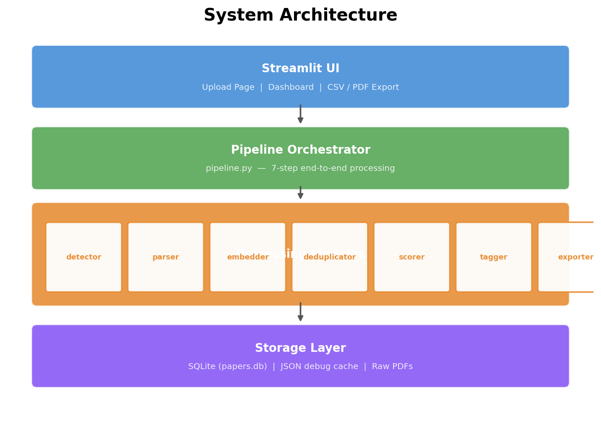
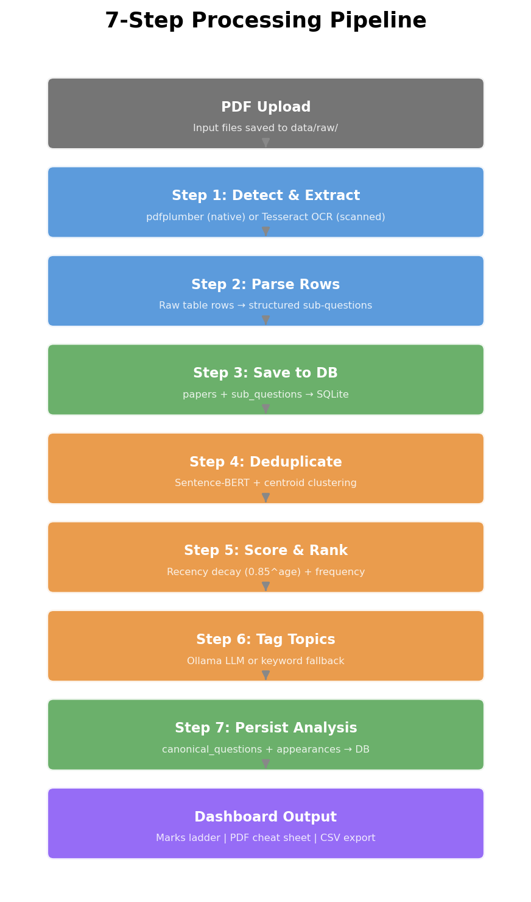
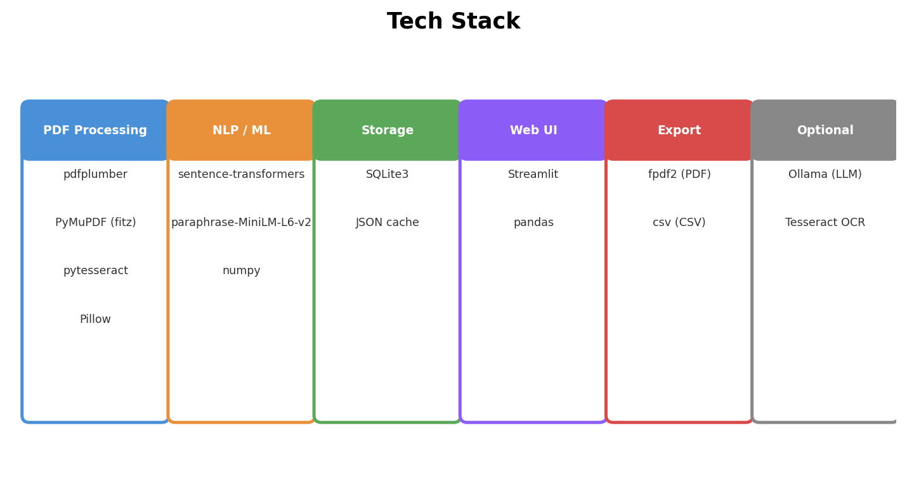

# Papers Please

**An AI-powered exam question analyser for VTU students and faculty.**

Built by **Nirbhik Chaki** and **Prabhat Anil Bajpai** at **CMR Institute of Technology, Bengaluru**.

A shared website where students find every past VTU paper for a subject already analysed: a ranked, module-wise breakdown of what to study first — backed by semantic NLP, not guesswork. When a new paper comes out, anyone can upload it and the subject updates for everyone.



---

## Table of Contents

- [The Problem](#the-problem)
- [Our Solution](#our-solution)
- [How It Works](#how-it-works)
- [The 7-Step Pipeline](#the-7-step-pipeline)
- [Algorithms and Research](#algorithms-and-research)
- [Tech Stack](#tech-stack)
- [Key Imports That Power It](#key-imports-that-power-it)
- [CSV Export for Teachers](#csv-export-for-teachers)
- [Data Model](#data-model)
- [Problems We Faced and How We Solved Them](#problems-we-faced-and-how-we-solved-them)
- [What We Learned](#what-we-learned)
- [Upload Safety](#upload-safety)
- [Setup and Usage](#setup-and-usage)
- [Deployment](#deployment)
- [Subject Map](#subject-map--adding-new-subjects)
- [Limitations and Future Work](#limitations-and-future-work)

---

## The Problem

VTU (Visvesvaraya Technological University) exams follow the CBCS pattern: 5 modules per subject, each worth 20 marks, 10 questions total with OR choices. Across exam sessions — January, June, December — **questions repeat**. Sometimes word-for-word. Sometimes rephrased: "Explain CRC" becomes "Describe CRC encoder operation with a neat diagram."

### The student's pain

- You have 4-5 past papers. Each has 30+ sub-questions. Across 5 papers, that is 150+ questions — but maybe only 40-50 are truly unique.
- There is **no systematic way** to know which questions repeat, which are one-offs, and which topics are gaining momentum in recent years.
- Students either study everything (burnout) or rely on word-of-mouth ("Module 3 is important this time") which is unreliable.
- The real cost: **wasted study hours on topics that have never been asked and probably won't be**.

### The teacher's pain

- Faculty setting internal assessment papers manually go through stacks of old papers to pick "good" questions.
- There is no structured, searchable question bank — just PDFs.
- Building a balanced internal paper (covering modules, bloom levels, marks distribution) is tedious manual work.

---

## Our Solution

Papers Please takes those same PDFs and turns them into actionable intelligence:

1. **Upload** VTU past papers (scanned or digital — both work) into a shared bank that every student can use.
2. The system **extracts every sub-question** with its marks, Bloom's taxonomy level, and course outcome.
3. An NLP model **detects when the same question appears across papers** — even when worded differently.
4. Each topic gets a **priority score** based on how often it repeats and how recently.
5. A **"Marks You Lock In" ladder** tells you: "Study these 3 topics and you statistically cover this module."
6. Export a **PDF cheat sheet** for quick revision or a **CSV question bank** that teachers can use to build internal assessments.

The key insight: **exam preparation is an optimisation problem**. Given limited study time, which topics maximise your expected marks? This tool answers that with data.

---

## How It Works

The system has a clean layered architecture:


- **Website** (`web/`, Next.js on Vercel) — pre-rendered pages for every subject; search, tabs, "studied" ticks and the topic graph all run in the browser
- **API + worker** (`server/`, FastAPI on Render) — serves precomputed subject snapshots, takes uploads, and runs the heavy work on one background thread
- **Processing Modules** (`modules/`) — each handles one concern: extraction, parsing, embedding, clustering, scoring, labelling, exporting
- **Storage** — Supabase Postgres (row-level security on every table) and a private Supabase Storage bucket for original PDFs; SQLite and a local folder when running on your machine

> The diagrams in `docs/` show the original single-machine Streamlit version. [ARCHITECTURE.md](ARCHITECTURE.md) describes the current system in detail.

---

## The 7-Step Pipeline

Every PDF goes through this pipeline from upload to the subject page:



### Step 1: Detect and Extract

The first challenge is reading the paper. VTU papers come in two forms:

| Type | What it is | Tool used |
|------|-----------|-----------|
| **Native** | Digitally created PDF with embedded text | `pdfplumber` |
| **Scanned** | Photo/scan with no text layer | `PyMuPDF` + `Tesseract OCR` |

Detection logic: if total extracted text < 100 characters or no tables found, treat as scanned.

For scanned PDFs, pages are rendered at **300 DPI** as grayscale arrays, then Tesseract runs in PSM 6 mode (uniform text block) to get word-level bounding boxes. Words are grouped into rows by vertical proximity and assigned to columns using **fixed proportional splits** calibrated from real VTU papers:

| Column | Page width range |
|--------|-----------------|
| Q.No | 0% – 13% |
| Sub | 13% – 17% |
| Question text | 17% – 74% |
| Marks | 74% – 83% |
| Bloom level | 83% – 89% |
| Course outcome | 89% – 98% |

### Step 2: Parse Rows

Raw table rows become structured sub-question records. The parser handles:
- **Garbled OCR** — "O22" means Q.2 (doubled digit), "0.7" means Q.7
- **Module headers** — "Module – 3" or garbled variants like "Mfodwle =P 1"
- **OR rows** — Skipped (these separate primary and alternate questions)
- **Continuation lines** — Multi-row question text is joined
- **Metadata extraction** — Marks, Bloom level (L1-L6), Course Outcome (CO1-CO5)

### Step 3: Save to DB

Before anything is saved, the uploader confirms the detected subject and exam session. Exact duplicates are caught by file hash, a second paper for an exam session that already has one goes to a moderator, and so does anything that looks partial or unfamiliar. See [Upload Safety](#upload-safety).

### Step 4: Deduplicate

This is the core algorithm. For each module of each subject, all sub-questions across all papers are encoded with **Sentence-BERT** and clustered using **centroid-based greedy clustering**. Questions like "Explain CRC" and "Describe CRC encoder operation with a diagram" land in the same cluster.

### Step 5: Score and Rank

Each canonical question gets a weighted score:
```
weighted_score = sum of 0.85^(current_year - paper_year) for each paper it appeared in
```
Recent appearances count more. A question in 4 out of 5 papers (80% frequency) with recent appearances scores higher than one in 2 out of 5 from 3 years ago.

### Step 6: Tag Topics

Each question cluster gets a short human-readable label. If Ollama (local LLM) is available, it generates labels like "CRC Encoder and Decoder". Otherwise the label is pulled out of the question itself — "What is data communication? List…" becomes "Data Communication".

### Step 7: Publish

The subject's ranking, cheat-sheet PDF and CSV are stored as one precomputed snapshot, and the website is told to refresh that subject's page. Topic keys stay stable between rebuilds, so students' "studied" ticks survive new papers arriving.

---

## Algorithms and Research

### Sentence-BERT Semantic Embeddings

**Model:** `paraphrase-MiniLM-L6-v2` from the `sentence-transformers` library.

- **Size:** ~90 MB, runs on CPU (no GPU required)
- **Output:** 384-dimensional dense vector per question
- **Why this model:** It is trained specifically on **paraphrase pairs** — meaning "Explain X" and "Describe the working of X with a diagram" map to nearby points in 384-D space

Why not `all-MiniLM-L6-v2` (the common default)? That model is trained on diverse web data for general similarity. Our problem is specifically about detecting **academic paraphrases** — same concept, different wording. The paraphrase-tuned variant handles this pattern significantly better.

All embeddings are **L2-normalised**, so cosine similarity reduces to a dot product — making similarity computation very efficient.

### Centroid-Based Greedy Clustering with Refinement Pass (Deduplication)

This is the core algorithm. It groups semantically similar questions into "canonical" question clusters using a **two-pass approach** for order-independent stability:

**Pass 1 — Greedy seeding:**
```
For each new question embedding:
    Compare against the centroid (mean) of every existing cluster
    If best similarity >= 0.70:
        Join that cluster, update its centroid incrementally
    Else:
        Start a new cluster with this question as seed
```

**Pass 2 — Refinement:**
```
Recompute all centroids from scratch (removes incremental-mean drift)
For each question:
    Reassign it to the nearest centroid via matrix multiply (N x K dot product)
    If best similarity < 0.70: keep as singleton
Drop any clusters that became empty
```

The second pass corrects cases where the greedy insertion order caused a question to land in a slightly suboptimal cluster. It also eliminates numerical drift from the incremental centroid updates.

**Why centroid-based?** Two questions A and B might not be directly similar to each other, but both might cluster around a centroid C. Comparing against centroids catches these transitive similarities.

**Why not k-means or DBSCAN?**
- k-means requires knowing the number of clusters upfront — we don't
- DBSCAN requires density parameters that don't generalise across modules
- Greedy clustering is O(N * C) where C << N, single-pass, and needs no hyperparameter tuning beyond the threshold

**Threshold = 0.70** was tuned on real VTU papers:
- 0.80+ is too strict — misses clear paraphrases like "explain X" vs "describe X with diagram"
- 0.60- is too loose — merges different topics within the same module

The centroid is updated using **Welford's incremental mean algorithm**, then re-normalised to unit length.

### Recency-Decay Scoring

Each canonical question is scored by both frequency and recency:

```
weighted_score = sum of DECAY^(current_year - paper_year)
```

Where `DECAY = 0.85`, giving:

| Paper year | Weight (if current = 2026) |
|------------|--------------------------|
| 2026 | 1.00 |
| 2025 | 0.85 |
| 2024 | 0.72 |
| 2023 | 0.61 |
| 2022 | 0.52 |

This is the same **exponential decay** model used in recommendation systems, financial momentum indicators, and email inbox aging. A question asked 3 times recently matters more than one asked 3 times five years ago.

**Expected marks** is calculated as:
```
expected_marks = (frequency / total_papers) * average_marks_when_asked
```

This answers: "If I study this topic, how many marks can I statistically expect?"

### Marks Ladder Construction

Questions are sorted by weighted score. Expected marks are accumulated top-down. When the cumulative sum hits the module max (20 marks), `full_coverage = True` — studying just those top N topics statistically covers the entire module.

---

## Tech Stack



| Library | Purpose | Why we chose it |
|---------|---------|----------------|
| **pdfplumber** | Native PDF table extraction | Best Python library for extracting tables with ruling lines from digital PDFs |
| **PyMuPDF (fitz)** | PDF-to-image rendering | Fastest Python PDF renderer — 300 DPI grayscale in milliseconds |
| **pytesseract** | OCR wrapper | Industry-standard Tesseract OCR with Python bindings |
| **Pillow** | Image format bridge | Converts between NumPy arrays and PIL Images for Tesseract |
| **ONNX Runtime + tokenizers** | Sentence-BERT embeddings | Same paraphrase model and outputs as sentence-transformers, without PyTorch — fits a 512 MB server |
| **numpy** | Matrix operations | Embedding arithmetic, dot products, centroid computation |
| **fpdf2** | PDF generation | Lightweight PDF builder — no heavyweight dependencies like ReportLab |
| **FastAPI + uvicorn** | API server | Typed request models, async uploads, auto-generated docs, and the whole pipeline stays in Python |
| **SQLAlchemy Core** | Database layer | One schema for SQLite (local) and Postgres (production) |
| **Supabase** | Postgres, file storage, moderator sign-in | Generous free tier; `pg_cron` + `pg_net` keep the API awake |
| **Next.js + Tailwind** | Website | Pre-rendered, indexable pages with instant client-side interaction; incremental regeneration refreshes a subject the moment it changes |
| **d3-force** | Topic graph | Small force-layout library, loaded only when the graph is opened |
| **Render / Vercel** | Hosting | Free Docker hosting for the API; free static + ISR hosting for the site |
| **ollama** | Optional LLM labelling | Local LLM labels when available; the phrase-based fallback needs nothing |

---

## Key Imports That Power It

These are the specific imports and API calls that make the core pipeline work:

**Rendering a scanned PDF page to a NumPy array at 300 DPI:**
```python
import fitz  # PyMuPDF
mat = fitz.Matrix(300/72, 300/72)    # scale factor for 300 DPI
pix = page.get_pixmap(matrix=mat, colorspace=fitz.csGRAY)
arr = np.frombuffer(pix.samples, dtype=np.uint8).reshape(pix.h, pix.w)
```

**Getting word-level bounding boxes from Tesseract (PSM 6 = uniform block):**
```python
import pytesseract
data = pytesseract.image_to_data(
    pil_image,
    output_type=pytesseract.Output.DICT,
    config="--psm 6",
)
# Returns dict with keys: text, left, top, width, height, conf
```

**Running the paraphrase-tuned Sentence-BERT on ONNX Runtime (mean pooling + L2 norm):**
```python
hidden = session.run(None, {"input_ids": ids, "attention_mask": mask, "token_type_ids": types})[0]
m = mask[:, :, None]
pooled = (hidden * m).sum(axis=1) / m.sum(axis=1)          # mean over real tokens
embeddings = pooled / np.linalg.norm(pooled, axis=1, keepdims=True)
# Now cosine_sim(a, b) == dot(a, b) since both are L2-normalised
```

**Incremental centroid update (Welford's algorithm) for online clustering:**
```python
n_members = len(cluster_members[best])
new_centroid = old_centroid + (new_vec - old_centroid) / n_members
new_centroid = new_centroid / np.linalg.norm(new_centroid)  # re-normalise
```

**One live paper per exam session, enforced by the database:**
```python
Index("uq_papers_live_session", papers.c.session_key, unique=True,
      sqlite_where=text("status = 'approved'"), postgresql_where=text("status = 'approved'"))
```

---

## CSV Export for Teachers

The CSV question bank is designed for **dual use**:

### For teachers setting internal assessments
- Export the full question bank as a CSV, sorted by module and priority
- Filter by module, marks range, or Bloom level to build a balanced paper
- Every question has been verified to appear in real VTU papers — no guesswork about difficulty or scope
- The frequency data shows which questions are "standard" vs niche

### For students using teacher-provided internals
- If your teacher uses this tool to build internals, the questions come from the same pool this tool analyses
- Study the high-frequency questions from the CSV and you are statistically preparing for both internals and the final exam

### CSV columns
| Column | Description |
|--------|-------------|
| Module | Module number (1-5) |
| Priority Rank | Rank within the module by weighted score |
| Topic Label | Short 3-5 word topic name |
| Question Text | Full representative question text |
| Avg Marks | Average marks when this question is asked |
| Times Repeated | Number of papers this question appeared in |
| Total Papers | Total papers analysed for this subject |
| Frequency % | How often it appears (percentage) |
| Years Seen | Which exam sessions it appeared in |
| Expected Marks | Statistical expected marks if you study this topic |
| Full Coverage | YES if studying up to this rank covers the full module |

---

## Data Model

The same schema runs on SQLite locally and Postgres (Supabase) in production:

- **papers** — One row per upload, with its moderation status (`processing`, `awaiting_confirmation`, `review`, `approved`, `rejected`, `failed`), detected subject and exam session, and the SHA-256 of the file (UNIQUE — the same file can't be added twice).
- **sub_questions** — Every sub-question extracted from a paper.
- **topics** — Deduplicated question groups per subject and module: representative text, label, frequency, weighted score, and a stable key.
- **topic_appearances** — Links each topic to every sub-question occurrence. This is how we track "Q3a in Jan 2025 and Q4b in Jul 2024 are the same question."
- **subject_snapshots** — The published result for each subject: the JSON the website renders, the cheat-sheet PDF and the CSV.
- **blocked_uploaders** — Uploaders a moderator has blocked.

Topics and snapshots are rebuilt from scratch whenever a subject's live papers change, ensuring consistency.

---

## Problems We Faced and How We Solved Them

### 1. OCR produces garbage for question numbers

Tesseract regularly reads "Q.2" as "O22", "0.7", "Qa", or "oO6". We built **loose regex patterns** with multiple fallback strategies:
```
Q.No patterns:  Q.1, O.4, 0.7, oO6, O22 (doubled digit → Q.2)
```
The doubled-digit pattern (`O22` → 2) was discovered by examining real OCR output across dozens of papers.

### 2. Column detection kept failing on pages with headers

Our initial approach used gap-based auto-detection to find column boundaries. It worked on clean pages but broke whenever headers, footers, or page numbers appeared — their word positions skewed the gap analysis.

**Solution:** We measured actual VTU papers and hardcoded **proportional column splits** (percentage of page width). VTU CBCS papers have a remarkably consistent layout, so fixed splits work reliably. This was a deliberate tradeoff: we lost generality but gained robustness for the specific domain.

### 3. "Explain X" vs "Describe X with a diagram" — are they the same?

The default similarity models (`all-MiniLM-L6-v2`) gave these a similarity of ~0.72 — below the typical 0.80 threshold. But for exam prep, these are clearly the same topic.

**Solution:** Switched to `paraphrase-MiniLM-L6-v2` (trained on paraphrase pairs) and lowered the threshold to 0.70. The paraphrase model gives these ~0.82 similarity, and the lower threshold catches the remaining edge cases.

### 4. Ollama not always available

Not every machine has Ollama installed. The tagger could not crash the pipeline just because topic labelling fails.

**Solution:** Three-tier fallback:
1. Try Ollama with the preferred model (phi3:mini)
2. Try any available model
3. Fall back to keyword-frequency extraction — no LLM needed

### 5. OCR text noise before embedding

Tesseract output contains artifacts: "AExplain" (run-together prefix), leading pipes and underscores, embedded sub-question labels ("a. Define..."). These degrade embedding quality.

**Solution:** A dedicated `_clean_for_embed()` function strips OCR-specific noise patterns before the text hits the embedding model, keeping the academic content intact.

### 6. Module header detection with garbled OCR

"Module – 3" becomes "Mfodwle =P 3" or "M[v]d — 1" after OCR. A strict regex only catches clean text.

**Solution:** A fuzzy regex chain:
1. Strict: `module\s*[-–—=~]*\s*(\d)` — catches clean headers
2. Fuzzy: `Mod(?:u|v|ul|ule)?\w*\s*[-–—=~P]+\s*([1-5])` — catches garbled OCR
3. Heuristic: short row with standalone digit 1-5 and no question words

---

## What We Learned

### Document Analysis and Information Extraction
- Real-world PDFs are messy — the gap between "works on clean examples" and "handles actual scanned papers" is enormous
- Domain-specific heuristics (VTU layout knowledge) often beat general-purpose algorithms
- OCR post-processing is as important as OCR quality itself

### NLP and Embedding Spaces
- Model choice matters more than parameter tuning — paraphrase-tuned vs general-purpose SBERT was a bigger win than threshold adjustment
- L2 normalisation is a simple trick that turns cosine similarity into dot products, making everything faster
- 384 dimensions is enough to capture semantic similarity for short academic text

### Clustering and Information Retrieval
- Online clustering algorithms are underappreciated — no need for offline batch processing when you can cluster in a single streaming pass
- Centroid-based matching is more robust than pairwise matching for catching transitive similarity
- Welford's incremental mean algorithm is elegant and numerically stable

### End-to-End ML Pipeline Design
- Separating extraction (I/O bound) from analysis (compute bound) in the pipeline makes progress reporting clean
- SQLite was plenty for a single-user local app; turning it into a shared website is what made Postgres, a job queue and moderation necessary
- Graceful degradation (Ollama fallback, OCR cleaning, flexible metadata extraction) makes the difference between a demo that works and one that crashes

---

## Upload Safety

Anyone can upload, so every upload is treated as hostile until it proves otherwise:

- **Quick checks first** — under 10 MB, a real PDF header, a Cloudflare Turnstile human check, and at most 10 uploads an hour per uploader. Moderators can block an uploader; uploaders are identified by a keyed hash of their IP, never the IP itself.
- **Read in a sandbox** — PDF parsing and OCR run in a separate, throwaway process with no access to secrets, a time limit, and (on Linux) CPU, memory and file-size limits. Encrypted files, more than 6 pages, or oversized pages are refused.
- **Stored by hash, never by name** — a crafted filename can't escape the storage folder, and originals are never shown to anyone.
- **Nothing is counted twice** — the same file is recognised by its SHA-256; each exam session can have only one live paper; a paper whose questions mostly match a live one is held for review.
- **Nothing junk goes live** — files that aren't question papers are rejected; partial scans and unknown subject codes wait for a moderator.
- **Locked-down data** — Supabase's public API can't read any table (row-level security with no policies); only the API server can.

The full threat table is in [ARCHITECTURE.md](ARCHITECTURE.md#upload-security).

---

## Setup and Usage

### Prerequisites

1. **Python 3.11+** and **Node.js 20+**
2. **Tesseract OCR** installed and on PATH
   - Windows: download from [UB-Mannheim](https://github.com/UB-Mannheim/tesseract/wiki), add the install directory to PATH
   - Linux: `sudo apt install tesseract-ocr`
   - macOS: `brew install tesseract`
3. (Optional) [Ollama](https://ollama.com) running locally with a model like `phi3:mini` for LLM topic labels

### Run it locally

Everything works without any accounts: the API uses SQLite (`data/app.db`) and a local folder for uploads.

```bash
git clone https://github.com/Nirbhik321/Papers-Please.git
cd Papers-Please
python -m venv .venv
.venv/Scripts/pip install -r requirements.txt        # macOS/Linux: .venv/bin/pip
cp .env.example .env                                   # set ADMIN_TOKEN to something long and random
```

Seed the database from a folder of past papers (runs the same checks as a student upload):

```bash
.venv/Scripts/python -m server.cli seed data/raw
```

Start the API (http://localhost:8000, docs at `/api/docs`):

```bash
.venv/Scripts/python -m uvicorn server.main:app --reload
```

Start the website (http://localhost:3000):

```bash
cd web
cp .env.example .env.local
npm install
npm run dev
```

On first use the embedding model (~90 MB) is downloaded from Hugging Face and cached.

### Using the site

1. **Home** — search by code or name (press `/`), or filter by branch and semester.
2. **Subject page** — module tabs, topics ranked by how often they repeat, every wording with the paper and question number it came from, "Mark studied" ticks that fill your coverage meter, the marks ladder, and a topic graph. Download the one-page **cheat sheet** or the **CSV question bank**.
3. **Upload** — drop PDFs, watch them get checked and read, confirm the subject and exam session, and see them go live.
4. **Moderation** — `/admin` (not linked anywhere). Sign in with the `ADMIN_TOKEN` locally, or a Supabase account listed in `ADMIN_EMAILS` in production.

### Command line

```bash
python -m server.cli seed <folder>               # import every PDF in a folder
python -m server.cli rebuild [CODE ...]          # republish subjects (all if none)
python -m server.cli rebuild --relabel           # …and regenerate topic labels
python -m server.cli status                      # paper counts by status
```

### Tests

```bash
.venv/Scripts/python -m pytest server/tests
```

The end-to-end tests use the sample papers in `data/raw` and are skipped if they aren't present. Set `TEST_DATABASE_URL` to an empty Postgres database to run the suite against Postgres.

---

## Deployment

The free-tier setup: **Vercel** (website) + **Render** (API) + **Supabase** (database, storage, moderator sign-in).

1. **Supabase**
   - Create a project. In the SQL editor run `supabase/migrations/20260928000000_schema.sql` (tables with row-level security + the private `uploads` bucket).
   - Under Authentication, create an account for each moderator.
   - Copy the **session pooler** connection string, the project URL, and the anon and service-role keys.
2. **Render** — New → Blueprint → this repository (`render.yaml`). Fill in the environment variables:
   `DATABASE_URL`, `SUPABASE_URL`, `SUPABASE_SERVICE_ROLE_KEY`, `SUPABASE_ANON_KEY`, `ADMIN_EMAILS`, `TURNSTILE_SECRET_KEY`, `CORS_ORIGINS` (your Vercel URL), `SITE_URL`, `REVALIDATE_URL` (`<vercel url>/api/revalidate`), `REVALIDATE_SECRET`.
3. **Keep-alive** — replace `YOUR-SERVICE` in `supabase/migrations/20260928000100_keepalive_cron.sql` with your Render hostname and run it in the Supabase SQL editor. It pings `/healthz` every 6 minutes so the free service never sleeps, and clears the cron history every 3 days.
4. **Vercel** — import the repository with **Root Directory = `web`** and set `NEXT_PUBLIC_API_URL` (your Render URL), `REVALIDATE_SECRET`, `NEXT_PUBLIC_TURNSTILE_SITE_KEY`, `NEXT_PUBLIC_SUPABASE_URL` and `NEXT_PUBLIC_SUPABASE_ANON_KEY`.
5. **Seed** — from your machine, point `DATABASE_URL`, `SUPABASE_URL` and `SUPABASE_SERVICE_ROLE_KEY` at production and run `python -m server.cli seed <folder>`, then `python -m server.cli rebuild` with `REVALIDATE_URL`/`REVALIDATE_SECRET` set so the site refreshes.

Cloudflare Turnstile keys are free: create a widget for your Vercel domain.

---

## Subject Map — Adding New Subjects

Papers Please ships with a `subjects.yaml` file in the project root containing **145+ subjects** across all VTU 2022 scheme computer-science programmes, semesters 1-6:

| Branch | Prefix | Semesters covered |
|--------|--------|-------------------|
| Computer Science and Engineering (CSE) | `BCS` | 1-6 |
| Information Science and Engineering (ISE) | `BIS` | 5-6 |
| AI and Machine Learning (AIML) | `BAI` | 5-6 |
| AI and Data Science (AIDS) | `BAD` | 5-6 |
| Data Science (DS) | `BDS` | 6 |
| Cross-branch open electives | `BEE`, `BCV`, `BME`, etc. | 6 |

**Adding a new subject requires zero code changes.** Just open `subjects.yaml` and add a line:

```yaml
BCS303: Operating Systems
BEE654B: Technologies of Renewable Energy Sources
```

The map is read at startup and falls back to the hardcoded defaults if the file is missing. Papers for codes that aren't in the file can still be uploaded — they wait for a moderator.

---

## Limitations and Future Work

| Limitation | Impact | Possible improvement |
|-----------|--------|---------------------|
| Fixed OCR column splits assume VTU A4 layout | Non-VTU papers will mis-bucket words | Adaptive column detection with fallback to fixed splits |
| Tesseract struggles with low-quality scans | Heavy shadows, rotation, coffee stains degrade OCR | Pre-processing with deskew, contrast normalisation |
| Single-paper subjects show no frequency data | Rankings fall back to marks-based sorting (still useful) | Show confidence intervals or flag as insufficient data |
| No cross-module similarity linking | Same topic in different modules treated as separate | By design (VTU assigns topics to modules), but could be a future option |
| Topic labels come from the question text on the free server | Some labels are clunky, especially from noisy OCR | A hosted LLM tier in `tagger.py`, then `rebuild --relabel` |
| Desktop-first website | Works on phones but isn't designed for them yet | Mobile layouts for the home, subject and upload pages |
| One API process (in-memory rate limits, one worker thread) | Fine for a free server, not for horizontal scaling | Move the queue and limits into Postgres, split API and worker |

---

*Built with purpose at CMR Institute of Technology, Bengaluru.*
